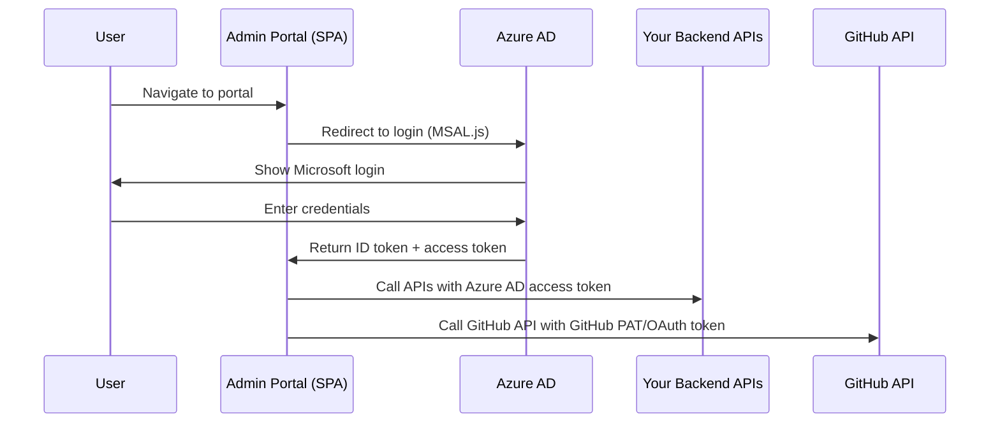

# Admin Portal — Finalized Architecture & Implementation Plan

> **Constraints confirmed**: GitHub · Azure AD · Existing backend APIs · 5–10 contributors · GitHub PRs for code review

---

## Finalized Tech Stack

| Layer | Tool | Rationale |
|-------|------|-----------|
| **Framework** | Vite + React 19 + TypeScript | Static SPA, zero server runtime |
| **Routing** | React Router v7 | Mature, file-friendly routing |
| **Server State** | TanStack Query v5 | Caching + sync for both your APIs and GitHub API |
| **Client State** | Zustand | Lightweight UI state (sidebar, modals, theme) |
| **UI Components** | shadcn/ui + Radix UI | Own the code, no dependency drift |
| **Code Editor** | Monaco Editor (`@monaco-editor/react`) | Syntax highlighting, diff view, IntelliSense |
| **Forms** | React Hook Form + Zod | Type-safe validation |
| **Styling** | Tailwind CSS v4 | Utility-first, purgeable, consistent |
| **Auth** | MSAL.js v2 (`@azure/msal-react`) | Microsoft's official Azure AD library for React SPAs |
| **GitHub Integration** | Octokit (`@octokit/rest`) | Official GitHub SDK, typed, well-maintained |
| **HTTP Client** | Axios (or native fetch + TanStack Query) | For your existing backend APIs |
| **Deployment** | Docker (Nginx) | Portable, ~25MB image |

---

## Architecture: Feature-Based

```
admin-portal/
├── public/
│   └── favicon.svg
├── src/
│   ├── app/
│   │   ├── App.tsx                  # Root component, providers, router
│   │   ├── routes.tsx               # Route definitions
│   │   └── providers/
│   │       ├── AuthProvider.tsx      # MSAL wrapper
│   │       ├── QueryProvider.tsx     # TanStack Query client
│   │       └── ThemeProvider.tsx     # Dark/light mode
│   │
│   ├── features/
│   │   ├── auth/
│   │   │   ├── components/
│   │   │   │   ├── LoginPage.tsx
│   │   │   │   ├── ProtectedRoute.tsx
│   │   │   │   └── UserMenu.tsx
│   │   │   ├── hooks/
│   │   │   │   └── useAuth.ts       # Wraps MSAL hooks
│   │   │   ├── config/
│   │   │   │   └── msalConfig.ts    # Azure AD app registration config
│   │   │   └── types.ts
│   │   │
│   │   ├── dashboard/
│   │   │   ├── components/
│   │   │   │   ├── DashboardPage.tsx
│   │   │   │   ├── StatsCards.tsx
│   │   │   │   └── RecentActivity.tsx
│   │   │   ├── hooks/
│   │   │   │   └── useDashboardStats.ts
│   │   │   └── api/
│   │   │       └── dashboardApi.ts
│   │   │
│   │   ├── code-editor/
│   │   │   ├── components/
│   │   │   │   ├── EditorPage.tsx
│   │   │   │   ├── MonacoEditor.tsx  # Monaco wrapper
│   │   │   │   ├── FileExplorer.tsx  # Tree view of repo files
│   │   │   │   ├── FileTabs.tsx      # Open file tabs
│   │   │   │   └── EditorToolbar.tsx # Save, commit, push actions
│   │   │   ├── hooks/
│   │   │   │   ├── useFileTree.ts
│   │   │   │   └── useEditorState.ts
│   │   │   ├── api/
│   │   │   │   └── githubFileApi.ts  # Octokit file operations
│   │   │   └── types.ts
│   │   │
│   │   ├── contributions/
│   │   │   ├── components/
│   │   │   │   ├── ContributionsPage.tsx
│   │   │   │   ├── ContributionList.tsx
│   │   │   │   └── SubmitContribution.tsx
│   │   │   ├── hooks/
│   │   │   │   └── useContributions.ts
│   │   │   ├── api/
│   │   │   │   └── contributionsApi.ts  # Your backend APIs
│   │   │   └── types.ts
│   │   │
│   │   └── settings/
│   │       ├── components/
│   │       │   └── SettingsPage.tsx
│   │       └── hooks/
│   │           └── useSettings.ts
│   │
│   ├── shared/
│   │   ├── components/
│   │   │   ├── ui/               # shadcn/ui components (Button, Card, etc.)
│   │   │   ├── layout/
│   │   │   │   ├── AppLayout.tsx    # Sidebar + header + content
│   │   │   │   ├── Sidebar.tsx
│   │   │   │   └── Header.tsx
│   │   │   └── feedback/
│   │   │       ├── LoadingSpinner.tsx
│   │   │       └── ErrorBoundary.tsx
│   │   ├── hooks/
│   │   │   ├── useApi.ts           # Generic API hook wrapping TanStack Query
│   │   │   └── useGitHub.ts        # Octokit instance with auth token
│   │   ├── lib/
│   │   │   ├── apiClient.ts        # Axios instance for your backend
│   │   │   ├── githubClient.ts     # Octokit instance factory
│   │   │   └── utils.ts
│   │   └── types/
│   │       └── api.ts              # Shared API response types
│   │
│   ├── styles/
│   │   └── globals.css             # Tailwind directives + custom styles
│   ├── main.tsx
│   └── vite-env.d.ts
│
├── .env.example                     # Template for env vars
├── Dockerfile
├── nginx.conf
├── tailwind.config.ts
├── tsconfig.json
├── vite.config.ts
└── package.json
```

---

## Key Integration Details

### 1. Azure AD Authentication Flow



**MSAL Configuration**:
- Register app in Azure AD → get `clientId` and `tenantId`
- Set redirect URI to your portal URL
- Request scopes: `User.Read`, `openid`, `profile`
- Use `@azure/msal-react` with `MsalProvider` + `useMsal()` hook
- Token is automatically refreshed by MSAL — zero maintenance

> [!IMPORTANT]
> For your **existing backend APIs**, attach the Azure AD access token as a `Bearer` token. Your backend validates it against Azure AD. This is the standard pattern — no custom auth logic in the frontend.

### 2. GitHub Integration Strategy

Since code review happens on GitHub directly, the portal focuses on **code contribution** (create branch → edit files → push → open PR):

| Action | GitHub API | Octokit Method |
|--------|-----------|----------------|
| List repos | `GET /orgs/{org}/repos` | `octokit.repos.listForOrg()` |
| Get file tree | `GET /repos/{owner}/{repo}/git/trees/{sha}` | `octokit.git.getTree()` |
| Read file | `GET /repos/{owner}/{repo}/contents/{path}` | `octokit.repos.getContent()` |
| Create branch | `POST /repos/{owner}/{repo}/git/refs` | `octokit.git.createRef()` |
| Update file | `PUT /repos/{owner}/{repo}/contents/{path}` | `octokit.repos.createOrUpdateFileContents()` |
| Create PR | `POST /repos/{owner}/{repo}/pulls` | `octokit.pulls.create()` |

**Auth for GitHub**: Two options:

| Option | Approach | Best For |
|--------|----------|----------|
| **GitHub App** (Recommended) | Install on your org, use installation token | Org-wide access, fine-grained permissions |
| **OAuth App** | Each user authorizes with their GitHub account | Per-user identity on commits |

> [!TIP]
> For 5–10 users, a **GitHub OAuth App** is simpler — each user logs in with their GitHub account, and commits show as *their* commits. You can trigger the GitHub OAuth flow separately from Azure AD (dual auth), or proxy it through your backend.

### 3. API Client Pattern

For your **existing backend APIs**, use a centralized Axios instance with automatic Azure AD token injection:

```typescript
// shared/lib/apiClient.ts
import axios from 'axios';
import { msalInstance } from '@/features/auth/config/msalConfig';

const apiClient = axios.create({
  baseURL: import.meta.env.VITE_API_BASE_URL,
});

apiClient.interceptors.request.use(async (config) => {
  const account = msalInstance.getActiveAccount();
  if (account) {
    const response = await msalInstance.acquireTokenSilent({
      scopes: ['api://<your-backend-app-id>/.default'],
      account,
    });
    config.headers.Authorization = `Bearer ${response.accessToken}`;
  }
  return config;
});

export default apiClient;
```

Then wrap each API call with TanStack Query for caching + sync:

```typescript
// features/contributions/api/contributionsApi.ts
import apiClient from '@/shared/lib/apiClient';
import { useQuery, useMutation } from '@tanstack/react-query';

export const useContributions = () =>
  useQuery({
    queryKey: ['contributions'],
    queryFn: () => apiClient.get('/contributions').then(r => r.data),
  });

export const useSubmitContribution = () =>
  useMutation({
    mutationFn: (data: ContributionPayload) =>
      apiClient.post('/contributions', data),
  });
```

---

## Pages & Components Breakdown

| Page | Key Components | Data Source |
|------|---------------|-------------|
| **Login** | Microsoft login button (MSAL redirect) | Azure AD |
| **Dashboard** | Stats cards, recent activity feed, quick actions | Your backend APIs |
| **Code Editor** | File explorer (tree), Monaco editor, file tabs, commit toolbar | GitHub API |
| **Contributions** | Contribution list (filterable table), submission form | Your backend APIs |
| **Settings** | Profile, GitHub connection, preferences | Your backend APIs + GitHub |

---

## Build Phases

### Phase 1 — Foundation *(~2 days)*
- Vite + React + TypeScript scaffold
- Tailwind CSS + shadcn/ui setup
- Azure AD auth with MSAL (login/logout, protected routes)
- App layout (sidebar, header, routing)
- API client with token injection

### Phase 2 — Core Features *(~3-4 days)*
- Dashboard page with stats from your APIs
- GitHub integration (Octokit setup, repo listing, file tree)
- Monaco Editor integration (read/edit files from GitHub)
- Code contribution workflow (branch → edit → commit → PR)

### Phase 3 — Polish *(~1-2 days)*
- Error boundaries and loading states
- Dark/light theme toggle
- Responsive design
- Docker + Nginx deployment setup

---

## Portability Checklist

| Concern | Solution |
|---------|----------|
| No vendor lock-in | Vite outputs static files, runs anywhere |
| No server runtime | Pure SPA, served by any static file server |
| Config per environment | `VITE_*` env vars at build time, or runtime `window.__ENV__` injection |
| Auth portable | MSAL.js works with any Azure AD tenant — just swap `clientId`/`tenantId` |
| GitHub portable | Swap org/repo config, same Octokit code works |
| Deployable anywhere | Docker image with Nginx (~25MB) |

---

## Shall I scaffold this?

If this architecture looks good, I can scaffold the entire project with:
- Working Azure AD login flow
- GitHub integration with Octokit
- Monaco Editor integrated
- Dashboard with sample components
- Full app layout with sidebar navigation
- Docker deployment setup

> [!NOTE]
> You'll need to provide your **Azure AD App Registration** details (`clientId`, `tenantId`) and **GitHub App/OAuth** credentials before the auth flows will work end-to-end. I'll set up the code with `.env` placeholders.
